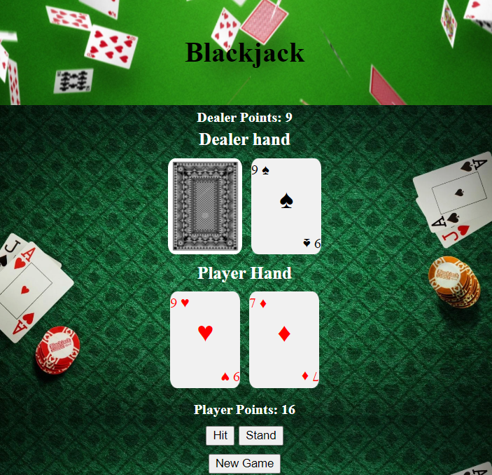
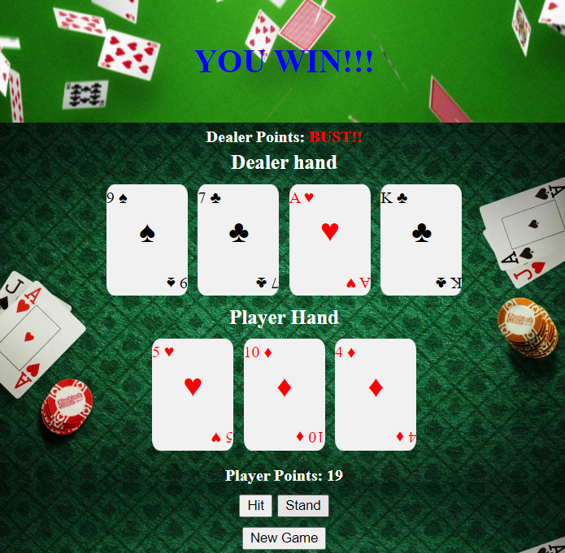

# Blackjack-game
Simple Blackjack game with only Hit/Pass options using vanilla HTML/JS/CSS


## Screenshots

<p align="center">
  
  
</p>


## Getting started

1. Clone the repo

```
git clone https://github.com/DiCastrum/Blackjack-game
cd Blackjack-game
```

3. Start 
```
using start index.HTML

or

use live server
```


## Built with

* HTML
* JavaScript
* CSS

## Author

Pedro de Castro - [Github](https://github.com/DiCastrum) - [LinkedIn](https://linkedin.com/in/pedro-de-castro-dicastrum)
